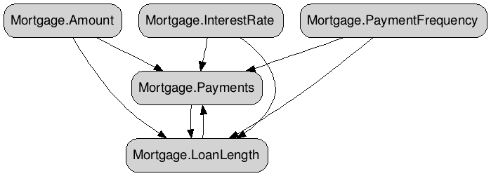

 ReactGraph
==========

ReactGraph is a library to make change propagation easy in .NET. It allows you to define formulas targeting properties and when any value used in that formula is changed it will be re-evaluated.

What makes ReactGraph useful is that it does not blindly react to changes, when any property changes it will perform a breadth-first topological sort to ensure each property is only recalculated once.

It is basically *excel formulas* in .net, except better.

ReactGraph was built because of pain building complex forms with many fields calculating defaults based on other fields changing common in larger line of buisiness applications. This library has not been used in production yet and we are putting it out there to see if people like the idea/implementation. 

Feedback welcome!

## A simple example - mortgage calculator
Our sample app includes a mortgage calculator which allows you to edit both payment amount and the loan length. Doing this can be problematic normally because it is cyclic in nature, because ReactGraph understands this it can break it apart.

This is our UI we want to make work  

Then we simply declare our formulas. 

	var mortgageEngine = new DependencyEngine();
	mortgageEngine
	    .Assign(() => Mortgage.Payments)
	    .From(() => MortgageCalculations.CalculatePayments(
	            Mortgage.Amount,
	            Mortgage.InterestRate,
	            Mortgage.LoanLength,
	            Mortgage.PaymentFrequency),
	            ex => { });
	
	mortgageEngine
	    .Assign(() => Mortgage.LoanLength)
	    .From(() => MortgageCalculations.CalculateLength(
	            Mortgage.Amount,
	            Mortgage.Payments,
	            Mortgage.InterestRate,
	            Mortgage.PaymentFrequency),
	            ex => { });

If I change the payment amount then I see the impact on the length of the loan  

We can then visualise the dependencies between the different fields and how they are related (using the ReactGraph.Visualisation library `.ToDotFormat()` extension method):  

We can also turn off formulas so we can just see the dependencies between fields with the following code:  

    mortgageEngine.ToDotFormat(options: new VisualisationOptions
            {
                ShowFormulas = false,
                ShowRoot = false
            });
            

## GraphViz Online Viewers
Currently ReactGraph just outputs graphs in [DOT](http://en.wikipedia.org/wiki/DOT_(graph_description_language)) format. You need to use an online viewer to then visualise the graph. 

[http://graphviz-dev.appspot.com/](http://graphviz-dev.appspot.com/)  
[http://stamm-wilbrandt.de/GraphvizFiddle/](http://stamm-wilbrandt.de/GraphvizFiddle/)  
[http://sandbox.kidstrythisathome.com/erdos/](http://sandbox.kidstrythisathome.com/erdos/)

### Icon
Network by Murali Krishna from The Noun Project
